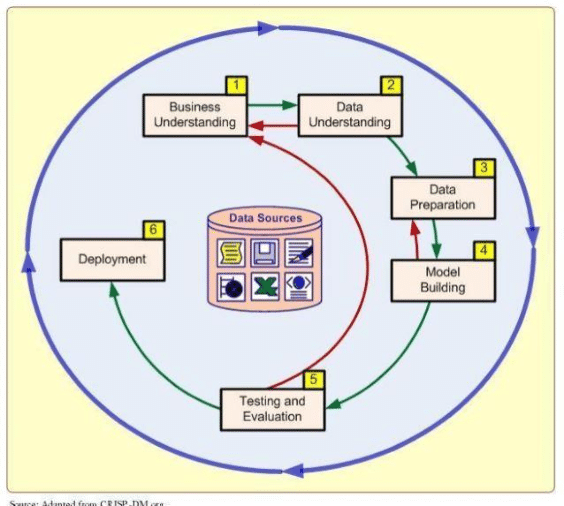

# Retail Data processing (DataMinning)

Objective of this project is predict prodect which will satisfy customers in given country
Also, I have practiced CRISP DM methodology for project development. All stages of CRISP DM is drawn on pivture bellow

# Structure
`1_business_understanding.ipynb` describe business objective and usage of this model
`2_data_understanding.ipynb` descrive what I have found on dataset (errors and data statistic)
`3_data_preparation.ipynb` on this file I clear data convert to needed format
`4_modeling.ipynb` during modeling I applied standart model (logistic regrression) to predict which product is popular in some country on some period
`5_evaluation.ipynb`  on evaluation stage I annalised what I have done
`Clustering.ipynb` on this stage I processed titles of the product: split into words and assign token to them and used tf–idf (term frequency - inverse document frequency)
`PCA.ipynb` I am goint to apply pca to compress tf-idf tokens.

